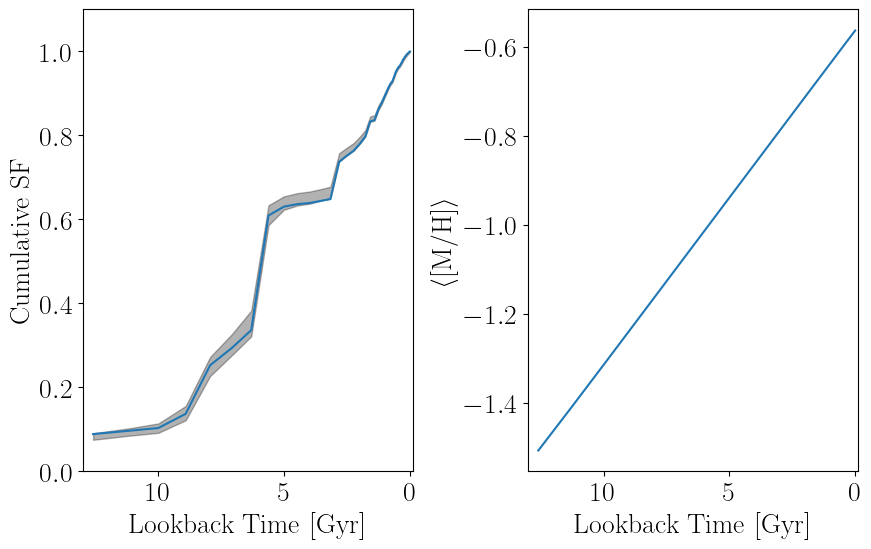

# [Deriving Star Formation Histories from Color-Magnitude Diagrams](@id fitting)

## Background

In the classic formulation of star formation history fitting from resolved-star photometry [(Dolphin 2002)](https://ui.adsabs.harvard.edu/abs/2002MNRAS.332...91D), an observed color-magnitude diagram (CMD) is binned into a 2-D histogram known as a Hess diagram. Such a CMD and Hess diagram pair is shown below.


The representation of the observations as a Hess diagram allows one to apply Poisson statistics, specifically the Poisson likelihood ratio (Equations 7--10 in Dolphin 2002), to model the observations. As the CMD of a complex stellar population is simply the sum of the CMDs of its sub-populations, one need only prepare a number of **templates** for each simple stellar population (SSP) which may make up the complex population in question and model the observed Hess diagram as a linear combination of these templates. Keeping the same notation as Dolphin 2002 (Equation 1), the complex model Hess diagram is simply

```math
m_i = \sum_j \, r_j \, c_{i,j}
```

where ``m_i`` is the value of the complex model in bin ``i``, ``c_{i,j}`` is the value of simple template ``j`` in bin ``i``, and ``r_j`` is the multiplicative coefficient determining how significant template ``j`` is to the complex population. In Dolphin 2002, he normalizes the templates to identical star formation rates (SFRs) and so the ``r_j`` are SFRs as well. In this package, we prefer to normalize our templates to identical population stellar masses, so our ``r_j`` are stellar masses, but the principal is the same.

Construction of the templates is, however, not a trivial exercise. Ideally, a template constructed to represent a particular SSP would accurately reflect the expectation of how such a population would be observed. Thus, these templates must be adjusted for photometric error, incompleteness, and other effects such as those caused by unresolved binary- and multi-star systems. Observational effects such as photometric error and incompleteness are best measured from artificial star tests (ASTs). It is worth mentioning that ASTs can often return "best case" results, as they typically neglect systematics like uncertainty in the point-spread model used for the photometry; as such it is sometimes necessary to add a systematic error floor to photometric error results from ASTs.

Such templates can be constructed by sampling many mock stars from an initial mass function (IMF), interpolating their absolute magnitudes from an isochrone of the relevant SSP, and "mock observing" them by applying photometric error and completeness functions (for example, by looking up the ``1\sigma`` photometric error and completeness value from a catalog of artificial stars). Such Monte Carlo templates can be slow to construct and exhibit Poisson shot-noise, requiring a statistical data--data comparison rather than a model--data comparison. Thus this method is non-optimal from both a practical and statistical perspective.

It is better to form what Dolphin 2002 calls a "blurred isochrone;" in this form of template, the SSP isochrone is first interpolated in initial stellar mass to improve the point density along the isochrone. The number of interpolated points is generally a function of the size of the bins in the Hess diagram and the observational error; more points are required as the bin size or photometric errors become smaller. These points are then weighted according to the IMF and the photometric completeness, and this weight is distributed into the Hess diagram following the photometric error distribution determined by similar artificial stars. Dolphin 2002 also mentions interpolating across stellar age/metallicity when constructing such templates; for example, for an SSP with an age of 1 Gyr and a metallicity of [M/H]=-1.0, you could interpolate the isochrones to introduce a Gaussian metallicity spread of 0.05 dex or an age spread of 100 Myr. The general effects of this form of interpolation is to broaden the model templates, particularly features that are very sharp in true SSP models. We neglect this form of interpolation in our implementation as it adds significant complexity and requires users to provide more information about the isochrones that are providing. Such widening of the individual templates is most impactful when photometric errors in the observational data are low (perhaps <0.10 mag).

## [Constructing Templates](@id templates)

While the above description summarizes the necessary components for constructing such a blurred isochrone, it can be a bit difficult to figure out how best to actually construct them. Specifically there are many ways that one could implement the observational effects of photometric error and incompleteness. We provide a method [`partial_cmd_smooth`](@ref) to construct such templates under the assumption of Gaussian photometric error distributions, which is often a good approximation in the high-completeness regime. This method makes use of user-defined functions for the mean photometric error and completeness as a function of magnitude and filter, such that these can be defined in a number of ways; for example, as direct lookups from a large table of ASTs or as simple function evaluations of analytic approximations or fits to the ASTs.

This method begins by interpolating the provided SSP isochrone to increase point density. For every such point with ``i`` band apparent magnitude ``m_i``, it calls a user-defined function to estimate the ``1\sigma`` photometric error as ``\sigma_i = f_i(m_i)``. The photometric error on the x-axis color for the Hess diagram is estimated from the individual-band ``\sigma_i``. These errors are used to define an asymmetric Gaussian kernel for each point in the interpolated isochrone. This kernel describes the shape of the probability distribution for where in the Hess diagram the isochrone point would be observed. However, it also must be normalized (weighted) according to the IMF and observational completeness functions.

Assume that the vector of initial stellar masses for the points in the interpolated isochrone are ``m_i`` and that they are sorted such that ``m_i < m_{i+1}``. The IMF weight on point ``m_i`` can be approximated as the number fraction of stars born between ``m_i`` and ``m_{i+1}`` divided by the mean mass per star born ``\langle m \rangle``, such that the weight effectively represents **the number of stars expected to be born with masses between ``m_i`` and ``m_{i+1}`` per solar mass of star formation**:

```math
\begin{aligned}
w_{i,\text{IMF}} &= \frac{ \int_0^{m_{i+1}} \frac{dN(m)}{dm} dm - \int_0^{m_{i}} \frac{dN(m)}{dm} dm }{\int_0^\infty m \times \frac{dN(m)}{dm} dm} = \frac{ \int_{m_i}^{m_{i+1}} \frac{dN(m)}{dm} dm }{\langle m \rangle}
\end{aligned}
```

The numerator can either be calculated as the difference in the cumulative distribution function across the bin or approximated efficiently via the trapezoidal rule. The denominator is a function only of the IMF and need only be calculated once. Multiplying this weight by the probability of detection in the relevant bands gives the final weight.

Below we show a comparison of a smooth Hess diagram template constructed with [`partial_cmd_smooth`](@ref) with a Monte Carlo realization created with [`generate_stars_mass`](@ref) and mock-observed with [`model_cmd`](@ref). These use an SSP isochrone of age 10 Gyr and metallicity [M/H] of -2 from PARSEC with identical observational error and completeness models. For the provided stellar mass of $10^7 \, \text{M}_\odot$, the Monte Carlo model is fairly well-sampled but still noticably noisy in regions of the Hess diagram that are less well-populated. 


```@docs
partial_cmd_smooth
```

We note that in many cases it can also be helpful to add in a foreground/background template that models contamination of the Hess diagram from stars not in your population of interest -- this is often done using observations of parallel fields though there are several other possible methods.

## High-Level Methods for Unconstrained Fitting

Template construction is by far the most complicated step in the fitting procedure. Once your templates have been constructed, fitting them to an observed Hess diagram amounts to maximization of the Poisson likelihood ratio (Dolphin 2002). It is possible to construct more complicated hierarchical models including things like metallicity distribution functions; we discuss these in the next section. In this section we discuss methods for fitting where the only constraint is that star formation rates cannot be negative. We provide the [`StarFormationHistories.construct_x0`](@ref) method to help with setting the initial guess for this optimization. 

```@docs
StarFormationHistories.construct_x0
```

When it comes to performing the optimization, the simplest method we offer is [`StarFormationHistories.fit_templates_lbfgsb`](@ref). This will optimize one coefficient per template; there is no overarching metallicity evolution or other constraint, besides that the stellar masses of the populations cannot be negative. This performs a maximum likelihood optimization with the bounded quasi-Newton LBFGS method as implemented in [L-BFGS-B](http://users.iems.northwestern.edu/~nocedal/lbfgsb.html) and wrapped in [LBFGS.jl](https://github.com/Gnimuc/LBFGSB.jl) with analytic gradients. It is fast and converges fairly reliably, even when the initial guess is not particularly close to the maximum likelihood estimate. It provides no uncertainty estimation. It is normal for some of the coefficients to converge to zero.

```@docs
StarFormationHistories.fit_templates_lbfgsb
```

This method simply minimizes the negative logarithm of the Poisson likelihood ratio (Equation 10 in Dolphin 2002),

```math
- \text{ln} \, \mathscr{L} = \sum_i m_i - n_i \times \left( 1 - \text{ln} \, \left( \frac{n_i}{m_i} \right) \right)
```

where ``m_i`` is bin ``i`` of the complex model and ``n_i`` is bin ``i`` of the observed Hess diagram; this can therefore be thought of as computing the maximum likelihood estimate.

We also provide [`StarFormationHistories.fit_templates_fast`](@ref), which is the fastest method we offer for deriving a maximum likelihood estimate for the type of model described above.

```@docs
StarFormationHistories.fit_templates_fast
```

## Posterior Sampling: MCMC

For low-dimensional problems, Markov Chain Monte Carlo (MCMC) methods can be an efficient way to sample the posterior and obtain uncertainty estimates on the fitting coefficients ``r_j``. We provide [`StarFormationHistories.mcmc_sample`](@ref) for this purpose. Internally this uses the multi-threaded affine-invariant MCMC sampler from [KissMCMC.jl](https://github.com/mauro3/KissMCMC.jl) to perform the sampling, which is based on the same algorithm as Python's [emcee](https://emcee.readthedocs.io/en/stable/) (specifically, their `emcee.moves.StretchMove`). There are other MCMC packages like [AdvancedMH.jl](https://github.com/TuringLang/AdvancedMH.jl) that offer additional features like distributed execution. 

```@docs
StarFormationHistories.mcmc_sample
```

## Posterior Sampling: Change of Variables and HMC

[Dolphin 2013](https://ui.adsabs.harvard.edu/abs/2013ApJ...775...76D/abstract) examined methods for obtaining uncertainties on the fitted coefficients (the ``r_j`` in Equation 1 of Dolphin 2002) and found that the Hamiltonian Monte Carlo (HMC) approach allowed for relatively efficient sampling of the posterior distribution when considering many isochrones in the modelling process. HMC requires that the variables to be fit are continuous over the real numbers and so requires a change of variables. Rather than sampling the variables ``r_j`` directly, we can sample ``\theta_j = \text{ln} \left( r_j \right)`` such that the sampled variables are continuous over the real numbers ``-\infty < \theta_j < \infty`` while the ``r_j=\text{exp} \left( \theta_j \right)`` coefficients are bounded from ``0 < r_j < \infty``. Using a logarithmic transformation has the additional benefit that the gradient of the Poisson likelihood ratio is still continuous and easy to compute analytically.

While maximum likelihood estimates are invariant under variable transformations, sampling methods like HMC are not, as formally the posterior being sampled from is a *distribution* and therefore must be integrable over the sampling coefficients. We can write the posterior from which we wish to sample as

```math
\begin{aligned}
p(r_j | D) &= \frac{p(D | r_j) \; p(r_j)}{Z} \\
p(\boldsymbol{r} | D) &= \frac{1}{Z} \; \prod_j p(D | r_j) \; p(r_j) \\
-\text{ln} \; p(\boldsymbol{r} | D) &= \text{ln} \, Z - \sum_j \, \text{ln} \, p(D | r_j) + \text{ln} \, p(r_j) \\
&= \text{ln} \, Z - \text{ln} \, \mathscr{L} + \sum_j \text{ln} \, p(r_j)
\end{aligned}
```

where ``Z`` is the Bayesian evidence (a constant that can be neglected for sampling methods), ``p \left( r_j \right)`` is the prior on the star formation history, and ``\mathscr{L}`` is the Poisson likelihood ratio discussed above. An uninformative (and unnormalized) prior on the coefficients ``r_j`` could take the form of

```math
p(r_j) = \begin{cases}
1; & r_j \geq 0\\
0; & r_j < 0
\end{cases}
```

such that, if the coefficients ``r_j`` are guaranteed to be positive, the final term becomes zero (since ``\text{ln}(1)=0``) and

```math
-\text{ln} \; p(\boldsymbol{r} | D) = \text{ln} \, Z - \text{ln} \, \mathscr{L}
```

When sampling with methods like HMC, constants like ``\text{ln} \, Z`` can be neglected and ``-\text{ln} \; p(\boldsymbol{r} | D) \propto - \text{ln} \, \mathscr{L}`` such that the posterior is approximated by the likelihood surface.

Let us consider now what happens when we wish to do a variable transformation from ``r_j`` to ``\theta_j = \text{ln} (r_j)``. From above we can write the posterior as

```math
p(r_j | D) = \frac{p(D | r_j) \; p(r_j)}{Z} \\
```

Under the change of variables formula we can write

```math
\begin{aligned}
p(\theta_j | D) &= p(r_j | D) \left| \frac{d r_j}{d \theta_j} \right| \\
&= p(r_j | D) \left| \frac{d \theta_j}{d r_j} \right|^{-1}
\end{aligned}
```

where ``\left| \frac{d \theta_j}{d r_j} \right|^{-1}`` is often called the Jacobian correction. We choose ``\theta_j`` such that

```math
\begin{aligned}
\theta_j &= \text{ln} ( r_j ) \\
\left| \frac{d \theta_j}{d r_j} \right| &= \frac{1}{r_j} \\
r_j &= \text{exp} (\theta_j) \\
\end{aligned}
```

which leads to a posterior of

```math
p(\theta_j | D) = \text{exp} (\theta_j) \times p(\text{exp} (\theta_j) | D) = r_j \times p(r_j | D) \\
```

We can then write the product over the ``\theta_j`` as

```math
\begin{aligned}
p(\boldsymbol{\theta} | D) &= \frac{1}{Z} \; \prod_j r_j \; p(D | r_j) \; p(r_j) \\
-\text{ln} \, p(\boldsymbol{\theta} | D) &= \text{ln} \, Z - \sum_j \text{ln} \, (r_j) + \text{ln} \, p(D | r_j) + \text{ln} \, p(r_j) \\
&= \text{ln} \, Z - \sum_j \text{ln} \, p(D | r_j) + \text{ln} \, p(r_j) - \sum_j \theta_j \\
&= -\text{ln} \, p(\boldsymbol{r} | D) - \sum_j \theta_j \\
&= -\text{ln} \, p(\boldsymbol{r} | D) - \sum_j \text{ln} \, (r_j)
\end{aligned}
```

The choice of a logarithmic transformation means that the negative logarithm of the posterior (which is what HMC uses for its objective function) has this very simple form which allows for simple analytic gradients as well. Once samples of ``\theta`` have been obtained from this distribution via HMC or any other sampling method, they can be directly transformed back to the standard coefficients ``r_j = \text{exp}(\theta_j)``.

The method [`hmc_sample`](@ref) implements this approach for sampling the ``\theta_j`` coefficients; these samples can then be used to estimate random uncertainties on the derived star formation history.

```@docs
StarFormationHistories.hmc_sample
```

See the [DynamicHMC.jl](https://github.com/tpapp/DynamicHMC.jl) documentation for more information on how to use the chains that are output by this method.

Inspection of the samples generated by `hmc_sample` shows that the posterior defined by the above model is typically smooth, well-behaved, and unimodal. In particular, we find that the sampled ``r_j`` for coefficients that are non-zero in the MLE are approximately Gaussian distributed while the logarithms of the sampled ``r_j`` are roughly Gaussian distributed for coefficients that are zero in the MLE; i.e.

```math
\begin{cases}
X_j \sim \mathcal{N}; & \hat r_j > 0 \\
\text{ln} \left( X_j \right) \sim \mathcal{N}; & \hat r_j = 0 \\
\end{cases}
```

where ``X_j`` are the samples of ``r_j`` obtained from the posterior and ``\hat r_j`` is the maximum likelihood estimate of ``r_j``. 

This indicates we may be able to approximate the posterior in the region surrounding the maximum a posteriori (MAP) value by the inverse of the Hessian matrix (see, e.g., [Dovi et al. 1991](https://doi.org/10.1016/0893-9659(91)90129-J)), allowing us to estimate parameter uncertainties very cheaply. The inverse of the Hessian matrix is exactly equal to the variance-covariance matrix of the parameters for a Gaussian probability distribution; for other probability distributions, the inverse of the Hessian approximates the variance-covariance matrix of the parameters when the second-order expansion defined by the Hessian at the maximum is a reasonable approximation to the real objective function being optimized. A particularly simple form arises when the logarithm of the objective is quadratic in the fitting parameters, as in the Gaussian case, because the second derivatives of the objective are constant and do not depend on the fitting parameters or the MAP estimate. 

Direct computation of the Hessian and its inverse is expensive, so we'd like another way to obtain it. The first-order, quasi-Newton BFGS optimization algorithm provides such a method as it iteratively builds a dense approximation to the inverse Hessian using the change in the gradient of the objective, which we can compute analytically. It is, however, much less memory efficient than the LBFGS algorithm we use in [`StarFormationHistories.fit_templates_lbfgsb`](@ref). For moderate isochrone grids up to a few hundred model templates, this is not a problem. Beyond this it may be better to use [`StarFormationHistories.fit_templates_lbfgsb`](@ref) to obtain the MLE and [`hmc_sample`](@ref) to obtain posterior samples.

We implement this optimization scheme in [`fit_templates`](@ref), which is our recommended method for unconstrained SFH fitting (i.e., direct fitting of the ``r_j`` coefficients). See the next section for notes on more complicated, hierarchical models that can incorporate features like metallicity distribution functions.

```@docs
StarFormationHistories.fit_templates
StarFormationHistories.LogTransformFTResult
```

Once you have obtained stellar mass coefficients from the above methods, you can convert them into star formation rates and compute per-age mean metallicities with [`StarFormationHistories.calculate_cum_sfr`](@ref).

```@docs
StarFormationHistories.calculate_cum_sfr
```

## Constrained Metallicity Evolution

While the above methods work well for optimizing the per-template ``r_j`` as a means for fitting SFHs, these methods can produce metallicity evolutions that could be considered unphysical, with large changes in the mean metallicity over small changes in time. An example of this type of behavior is shown in the SFH fit below.


While some metallicity variation in the star-forming gas is to be expected, these variations in the SFH fit can end up being quite large depending on the data and isochrone grid adopted. A solution is to construct a more physically-motivated model.

We can do this using a hierarchical model with a parameterized metallicity distribution function (MDF) where the the ``r_j`` are not the parameters directly optimized. Rather, we can optimize one stellar mass (or star formation rate) parameter per age bin, and then a number of MDF parameters that determine how that stellar mass is split between models with different metallicities at fixed age. An example for one such MDF model is a linear mean metallicity relation ``\langle [\text{M}/\text{H}] \rangle (t) = \alpha \, t + \beta`` with a Gaussian distribution in metallicity at fixed age. If the per-age-bin stellar mass coefficients are ``R_j``, the age of the stellar population ``j`` is ``t_j``, and the metallicity of population ``k`` is ``[\text{M}/\text{H}]_k``, then we can write the per-model ``r_{j,k}`` (where we are now using separate indices for age and metallicity) as

```math
\begin{aligned}
\mu_j &= \alpha \, t_j + \beta \\
r_{j,k} &= R_j \, \frac{ \text{exp} \left( - \left( \frac{ [\text{M}/\text{H}]_k - \mu_j}{\sigma} \right)^2 \right)}{\sum_k \text{exp} \left( - \left( \frac{ [\text{M}/\text{H}]_k - \mu_j}{\sigma} \right)^2 \right)}
\end{aligned}
```

where the numerator is the MDF at fixed age evaluated at metallicity ``[\text{M}/\text{H}]_k`` and the denominator is a normalizing coefficient that ensures ``\sum_k r_{j,k} = R_j``. In this notation, bin ``i`` of the complex model Hess diagram (equation 1 of Dolphin 2002) is

```math
m_i = \sum_{j,k} \, r_{j,k} \; c_{i,j,k}
```

Below we show a fit using this hierarchical model to the same data as above. 



We provide the method [`StarFormationHistories.fit_templates_mdf`](@ref) to fit this model to an observed Hess diagram.

```@docs
StarFormationHistories.fit_templates_mdf
StarFormationHistories.LogTransformMDFσResult
StarFormationHistories.LogTransformMDFResult
```

The method [`StarFormationHistories.construct_x0_mdf`](@ref) can be used to construct the stellar mass components ``R_j`` of the initial guess vector `x0`

```@docs
StarFormationHistories.construct_x0_mdf
```

and [`StarFormationHistories.calculate_coeffs_mdf`](@ref) can be used to calculate per-template stellar mass coefficients (the ``r_{j,k}`` above) given the results of a fit (which will be the ``R_j`` in the equations above)

```@docs
StarFormationHistories.calculate_coeffs_mdf
```

We additionally offer a sampling method for this linear age-metallicity relation using HMC:

```@docs
StarFormationHistories.hmc_sample_mdf
```

### Implementation

While one could optimize the above model without an analytic gradient, such gradient-free methods are typically slower and less robust. One could also calculate the gradient numerically using finite differences or auto-differentiation, but these are still slower than analytic calculations. We will show that the gradient of this hierarchical model is analytic, allowing us to design an efficient optimization scheme.

Equation 21 in Dolphin 2001 gives the gradient of our objective function with respect to the underlying coefficients

```math
\begin{aligned}
F \equiv - \text{ln} \, \mathscr{L} &= \sum_i m_i - n_i \times \left( 1 - \text{ln} \, \left( \frac{n_i}{m_i} \right) \right) \\
\frac{\partial \, F}{\partial \, r_{j,k}} &= \sum_i c_{i,j,k} \left( 1 - \frac{n_i}{m_i} \right)
\end{aligned}
```

where ``c_{i,j,k}`` is the value of template ``j,k`` in bin ``i`` and ``n_i`` is bin ``i`` of the observed Hess diagram. These partial derivatives are easy to obtain, but we need partials with respect to the fitting parameters ``R_j``. Given the above relation between ``r_{j,k}`` and ``R_j``, we can calculate these derivatives as

```math
\begin{aligned}
\frac{\partial \, F}{\partial \, R_j} &= \sum_k \, \frac{\partial \, F}{\partial \, r_{j,k}} \, \frac{\partial \, r_{j,k}}{\partial \, R_j} \\
\frac{\partial \, r_{j,k}}{\partial \, R_j} &= \frac{ \text{exp} \left( - \frac{1}{2} \left( \frac{ [\text{M}/\text{H}]_k - \mu_j}{\sigma} \right)^2 \right)}{\sum_k \text{exp} \left( - \frac{1}{2} \left( \frac{ [\text{M}/\text{H}]_k - \mu_j}{\sigma} \right)^2 \right)} = \frac{r_{j,k}}{R_j}
\end{aligned}
```

Then we need only the partial derivatives of the objective function ``F`` with respect to the MDF parameters, which in this case are ``\alpha, \beta, \sigma``. For convenience we will rewrite

```math
r_{j,k} = R_j \, \frac{ \text{exp} \left( - \frac{1}{2} \left( \frac{ [\text{M}/\text{H}]_k - \mu_j}{\sigma} \right)^2 \right)}{\sum_k \text{exp} \left( - \frac{1}{2} \left( \frac{ [\text{M}/\text{H}]_k - \mu_j}{\sigma} \right)^2 \right)} = R_j \, \frac{A_{k,j}}{\sum_k A_{k,j}}
```

as many different types of models can be expressed via this simplified notation by substituting the ``A_{k,j}`` with different distributions. This allows us to write 

```math
\begin{aligned}
\frac{\partial \, F}{\partial \, \beta} &= \sum_{j,k} \frac{\partial \, F}{\partial \, r_{j,k}} \, \frac{\partial \, r_{j,k}}{\partial \, \beta} \\
\frac{\partial \, r_{j,k}}{\partial \, \beta} &= R_j \left( \frac{1}{\sum_k \, A_{k,j}} \, \frac{\partial \, A_{k,j}}{\partial \, \beta} - \frac{A_{j,k}}{\left( \sum_k \, A_{k,j} \right)^2} \, \frac{\partial \, \sum_k \, A_{k,j}}{\partial \, \beta} \right)  \\
&= \frac{R_j}{\sum_k \, A_{k,j}} \left( \frac{\partial \, A_{k,j}}{\partial \, \beta} - \frac{A_{j,k}}{\sum_k \, A_{k,j}} \sum_k \frac{\partial \, A_{k,j}}{\partial \, \beta} \right) \\
\end{aligned}
```

Given our specific definition of ``A_{j,k}`` being a Gaussian distribution, we have

```math
\begin{aligned}
\mu_j &= \alpha \, t_j + \beta \\
\frac{\partial \, A_{k,j}}{\partial \, \beta} &= \frac{\partial}{\partial \, \beta} \, \left[ \text{exp} \left( - \frac{1}{2} \left( \frac{ [\text{M}/\text{H}]_k - \mu_j}{\sigma} \right)^2 \right) \right] \\
&= \frac{A_{j,k}}{\sigma^2} \left( [\text{M}/\text{H}]_k - \mu_j \right)
\end{aligned}
```

We can now substitute this result into the above expressions to write

```math
\begin{aligned}
\frac{\partial \, F}{\partial \, \beta} &= \sum_{j,k} \frac{\partial \, F}{\partial \, r_{j,k}} \, \frac{\partial \, r_{j,k}}{\partial \, \beta} \\
&= \sum_{j,k} \frac{\partial \, F}{\partial \, r_{j,k}} \, \frac{R_j}{\sum_k \, A_{k,j}} \left( \frac{\partial \, A_{k,j}}{\partial \, \beta} - \frac{A_{j,k}}{\sum_k \, A_{k,j}} \sum_k \frac{\partial \, A_{k,j}}{\partial \, \beta} \right) \\
&= \sum_{j,k} \frac{\partial \, F}{\partial \, r_{j,k}} \, \frac{R_j}{\sigma^2 \, \sum_k \, A_{k,j}} \left( A_{j,k} \left( [\text{M}/\text{H}]_k - \mu_j \right) - \frac{A_{j,k}}{\sum_k \, A_{k,j}} \sum_k A_{j,k} \left( [\text{M}/\text{H}]_k - \mu_j \right) \right)
\end{aligned}
```

It can be shown that the partial derivative of ``F`` with respect to ``\alpha`` is simply

```math
\frac{\partial \, F}{\partial \, \alpha} = \sum_{j,k} \frac{\partial \, F}{\partial \, r_{j,k}} \, \frac{\partial \, r_{j,k}}{\partial \, \alpha} = \sum_{j,k} \frac{\partial \, F}{\partial \, r_{j,k}} \, \frac{\partial \, r_{j,k}}{\partial \, \beta} \times t_j \\
```

The partial derivative with respect to ``\sigma`` is slightly more complicated, but we can start identically to how we started above when deriving ``\frac{\partial \, F}{\partial \, \beta}`` with

```math
\begin{aligned}
\frac{\partial \, F}{\partial \, \sigma} &= \sum_{j,k} \frac{\partial \, F}{\partial \, r_{j,k}} \, \frac{\partial \, r_{j,k}}{\partial \, \sigma} \\
\frac{\partial \, r_{j,k}}{\partial \, \sigma} &= R_j \left( \frac{1}{\sum_k \, A_{k,j}} \, \frac{\partial \, A_{k,j}}{\partial \, \sigma} - \frac{A_{j,k}}{\left( \sum_k \, A_{k,j} \right)^2} \, \frac{\partial \, \sum_k \, A_{k,j}}{\partial \, \sigma} \right)  \\
&= \frac{R_j}{\sum_k \, A_{k,j}} \left( \frac{\partial \, A_{k,j}}{\partial \, \sigma} - \frac{A_{j,k}}{\sum_k \, A_{k,j}} \sum_k \frac{\partial \, A_{k,j}}{\partial \, \sigma} \right) \\
\end{aligned}
```

Then all we need is

```math
\frac{\partial \, A_{k,j}}{\partial \, \sigma} = \frac{A_{k,j} \, \left( [\text{M}/\text{H}]_k - \mu_j \right)^2}{\sigma^3}
```

which we can substitute into the above expressions to find ``\frac{\partial \, F}{\partial \, \sigma}``.

## Fixed Age-Metallicity Relations and Metallicity Distribution Functions

```@docs
StarFormationHistories.fixed_amr
```

## Developer Internals

```@docs
StarFormationHistories.composite!
StarFormationHistories.loglikelihood
StarFormationHistories.∇loglikelihood
StarFormationHistories.∇loglikelihood!
StarFormationHistories.fg!
StarFormationHistories.truncate_relweights
StarFormationHistories.stack_models
```