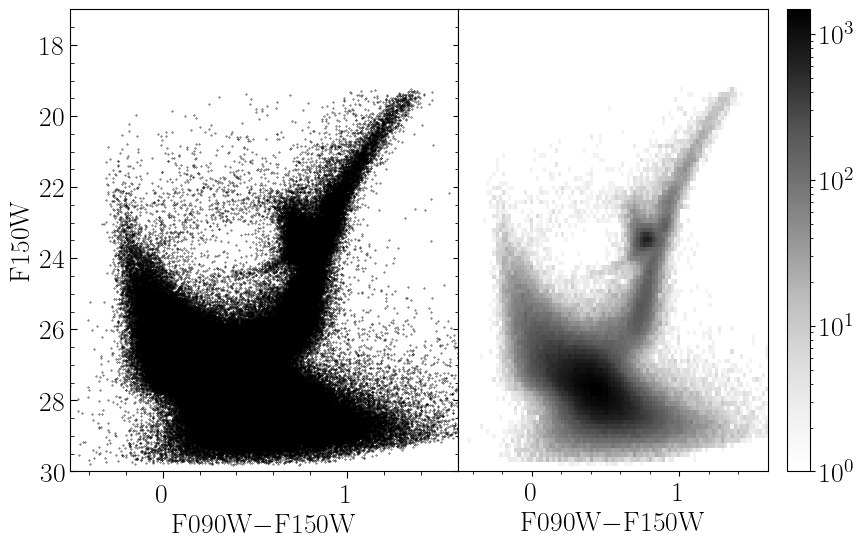

# [Background and Template Construction](@id fitting)

## Background

In the classic formulation of star formation history fitting from resolved-star photometry [(Dolphin 2002)](https://ui.adsabs.harvard.edu/abs/2002MNRAS.332...91D), an observed color-magnitude diagram (CMD) is binned into a 2-D histogram known as a Hess diagram. Such a CMD and Hess diagram pair is shown below.



The representation of the observations as a Hess diagram allows one to apply Poisson statistics, specifically the Poisson likelihood ratio (Equations 7--10 in Dolphin 2002), to model the observations. As the CMD of a complex stellar population is simply the sum of the CMDs of its sub-populations, one need only prepare a number of **templates** for each simple stellar population (SSP) which may make up the complex population in question and model the observed Hess diagram as a linear combination of these templates. Keeping the same notation as Dolphin 2002 (Equation 1), the complex model Hess diagram is simply

```math
m_i = \sum_j \, r_j \, c_{i,j}
```

where ``m_i`` is the value of the complex model in bin ``i``, ``c_{i,j}`` is the value of simple template ``j`` in bin ``i``, and ``r_j`` is the multiplicative coefficient determining how significant template ``j`` is to the complex population. In Dolphin 2002, he normalizes the templates to identical star formation rates (SFRs) and so the ``r_j`` are SFRs as well. In this package, we prefer to normalize our templates to identical population stellar masses, so our ``r_j`` are stellar masses, but the principal is the same.

Construction of the templates is, however, not a trivial exercise. Ideally, a template constructed to represent a particular SSP would accurately reflect the expectation of how such a population would be observed. Thus, these templates must be adjusted for photometric error, incompleteness, and other effects such as those caused by unresolved binary- and multi-star systems. Observational effects such as photometric error and incompleteness are best measured from artificial star tests (ASTs). It is worth mentioning that ASTs can often return "best case" results, as they typically neglect systematics like uncertainty in the point-spread model used for the photometry; as such it is sometimes necessary to add a systematic error floor to photometric error results from ASTs.

Such templates can be constructed by sampling many mock stars from an initial mass function (IMF), interpolating their absolute magnitudes from an isochrone of the relevant SSP, and "mock observing" them by applying photometric error and completeness functions (for example, by looking up the ``1\sigma`` photometric error and completeness value from a catalog of artificial stars). Such Monte Carlo templates can be slow to construct and exhibit Poisson shot-noise, requiring a statistical data--data comparison rather than a model--data comparison. Thus this method is non-optimal from both a practical and statistical perspective.

It is better to form what Dolphin 2002 calls a "blurred isochrone;" in this form of template, the SSP isochrone is first interpolated in initial stellar mass to improve the point density along the isochrone. The number of interpolated points is generally a function of the size of the bins in the Hess diagram and the observational error; more points are required as the bin size or photometric errors become smaller. These points are then weighted according to the IMF and the photometric completeness, and this weight is distributed into the Hess diagram following the photometric error distribution determined by similar artificial stars. Dolphin 2002 also mentions interpolating across stellar age/metallicity when constructing such templates; for example, for an SSP with an age of 1 Gyr and a metallicity of [M/H]=-1.0, you could interpolate the isochrones to introduce a Gaussian metallicity spread of 0.05 dex or an age spread of 100 Myr. The general effects of this form of interpolation is to broaden the model templates, particularly features that are very sharp in true SSP models. We neglect this form of interpolation in our implementation as it adds significant complexity and requires users to provide more information about the isochrones that are providing. Such widening of the individual templates is most impactful when photometric errors in the observational data are low (perhaps <0.10 mag).

## [Constructing Templates](@id templates)

While the above description summarizes the necessary components for constructing such a blurred isochrone, it can be a bit difficult to figure out how best to actually construct them. Specifically there are many ways that one could implement the observational effects of photometric error and incompleteness. We provide a method [`partial_cmd_smooth`](@ref) to construct such templates under the assumption of Gaussian photometric error distributions, which is often a good approximation in the high-completeness regime. This method makes use of user-defined functions for the mean photometric error and completeness as a function of magnitude and filter, such that these can be defined in a number of ways; for example, as direct lookups from a large table of ASTs or as simple function evaluations of analytic approximations or fits to the ASTs.

This method begins by interpolating the provided SSP isochrone to increase point density. For every such point with ``i`` band apparent magnitude ``m_i``, it calls a user-defined function to estimate the ``1\sigma`` photometric error as ``\sigma_i = f_i(m_i)``. This is done for each provided photometric filter. These errors are used to define an asymmetric 2-D Gaussian kernel for each point in the interpolated isochrone. This kernel describes the probability distribution of where the isochrone point would be observed in the Hess diagram. The shape of the kernel is automatically adjusted to account for covariance when the magnitude on the y-axis of the Hess diagram also appears in the x-axis color, as occurs when only two filters of imaging are available (for example, an x-axis of ``B-V`` and a y-axis magnitude of ``V``). Details on these kernels are given [here](@ref kernels). However, the kernel also must be normalized (weighted) according to the IMF and observational completeness functions.

Assume that the vector of initial stellar masses for the points in the interpolated isochrone are ``m_i`` and that they are sorted such that ``m_i < m_{i+1}``. The IMF weight on point ``m_i`` can be approximated as the number fraction of stars born between ``m_i`` and ``m_{i+1}`` divided by the mean mass per star born ``\langle m \rangle``, such that the weight effectively represents **the number of stars expected to be born with masses between ``m_i`` and ``m_{i+1}`` per solar mass of star formation**:

```math
\begin{aligned}
w_{i,\text{IMF}} &= \frac{ \int_0^{m_{i+1}} \frac{dN(m)}{dm} dm - \int_0^{m_{i}} \frac{dN(m)}{dm} dm }{\int_0^\infty m \times \frac{dN(m)}{dm} dm} = \frac{ \int_{m_i}^{m_{i+1}} \frac{dN(m)}{dm} dm }{\langle m \rangle}
\end{aligned}
```

The numerator can either be calculated as the difference in the cumulative distribution function across the bin or approximated efficiently via the trapezoidal rule. The denominator is a function only of the IMF and need only be calculated once. Multiplying this weight by the probability of detection in the relevant bands gives the final weight.

```@example
mv("../../../examples/templates/template_compare.svg", "figures/template_compare.svg") # hide
mv("../../../examples/templates/sigma_distribution.svg", "figures/sigma_distribution.svg") # hide
nothing # hide
```

A worked example comparing a sampled stellar population with a smooth Hess diagram template is available in `examples/templates/smooth_template.jl`. The smooth Hess diagram template is constructed with [`partial_cmd_smooth`](@ref) and the Monte Carlo population is sampled with [`generate_stars_mass`](@ref), with observational effects modelled by [`model_cmd`](@ref). The isochrone used comes from PARSEC and has an age of 12.6 Gyr and initial metallicity [M/H] of -2.8. The output figure is shown below. A distance modulus of 25 mag is used for this example, with photometric error and completeness functions roughly based on those we observe in the JWST/NIRCAM data of WLM (see [Weisz et al. 2024](https://ui.adsabs.harvard.edu/abs/2024ApJS..271...47W)).


At left is a population of stars sampled from an SSP with the methods described in the section of the documentation on [simulating CMDs](@ref simulate). The points from the isochrone are colored orange. The next figure shows the binned Hess diagram derived from these data. The next figure shows our smooth Hess diagram template calculated for this SSP. The final figure at right shows the residual between the data and model in units of standard deviations. These are sometimes called Pearson residuals. Below we show the distribution of these residuals, which should be Gaussian with mean 0 and standard deviation 1 if the model were perfect. Note that, because all bins with 0 observed stars are excluded from the distribution and the observed Hess diagram contains Poisson error, the mean of our distribution will always be slightly higher than 0. We do, however, achieve a standard deviation of nearly 1, indicating that our model is robust. We show a Gaussian PDF with standard deviation 1 and mean equal to the observed mean of the residuals for comparison.


The method used to create these smooth Hess diagram templates is [`partial_cmd_smooth`](@ref).

```@docs
partial_cmd_smooth
```

The user-provided functions returning magnitude errors (`mag_err_funcs`) and completeness values (`completness_functions`) given a star's intrinsic apparent magnitude are important for deriving good templates. These are typically derived from catalogs of artificial star tests. Some helper functions for constructing these are provided [here](@ref phot_helpers).

We note that in many cases it can also be helpful to add in a foreground/background template that models contamination of the Hess diagram from stars not in your population of interest -- this is often done using observations of parallel fields though there are several other possible methods.

Photometric catalogs can be processed into Hess diagrams meeting our formatting requirements with the method [`bin_cmd`](@ref StarFormationHistories.bin_cmd).

```@docs
StarFormationHistories.bin_cmd
```

## A Note on Array Formatting

It is expected that the user will typically have model templates stored as two-dimensional matrices as these are the obvious choice for representing a binned two-dimensional histogram. We fully support supplying the list of model templates as a list of matrices (e.g., a `Vector{Matrix{<:Number}}`) to the fitting functions discussed below. The important computational kernels [`composite!`](@ref StarFormationHistories.composite!) and [`∇loglikelihood!`](@ref StarFormationHistories.∇loglikelihood!) have custom loops for these input types.

However, additional optimizations are possible by flattening the data. By flattening each matrix in the list of model templates into a column vector and concatenating them such that the list of model templates becomes a single matrix, we can compute the complex model Hess diagram as a single matrix-vector product rather than using a custom loop. The same optimization can be made when computing the gradient of the loglikelihood (discussed more below). The majority of all computation for the fitting methods below is spent in these two functions, so optimizing their performance translates directly to improved fitting runtimes. With this flattened memory arrangement we can use the highly optimized `LinearAlgbera.mul!` method to do the in-place matrix-vector product. This will typically be translated into a call to a BLAS function like `gemv!`. As such, we can benefit from Julia's ability to switch BLAS implementations at runtime to use Intel's [Math Kernel Library](https://github.com/JuliaLinearAlgebra/MKL.jl), Apple's [Accelerate](https://github.com/JuliaLinearAlgebra/AppleAccelerate.jl), and [others](https://github.com/JuliaLinearAlgebra/libblastrampoline).

Most of the fitting methods below support both the natural and flattened data layouts. We provide the [`stack_models`](@ref StarFormationHistories.stack_models) method to produce the optimized layout for the list of model templates.

```@docs
StarFormationHistories.stack_models
```

## A Note on Threading

While generally the methods using BLAS routines offer significant performance improvements, there is a caveat when multithreading from within Julia. By default Julia will allow BLAS to use multiple threads even if Julia itself is started with a single thread (i.e., by running `julia -t 1`). BLAS threads do not compose with Julia threads. That is, if you start Julia with `N>1` threads (`julia -t N`) and write a threaded workload where each Julia thread is doing BLAS operations concurrently, you can easily oversubscribe the CPU. Specific recommendations vary depending on BLAS vendor (see [this page](https://carstenbauer.github.io/ThreadPinning.jl/dev/explanations/blas/) and the linked discourse threads), but generally this package is in the regime of doing many small calculations that do not individually benefit much from BLAS threading (e.g., performance for OpenBLAS with 8 threads is only ~2x the 1 thread performance). As such it is often sufficient to set BLAS to use a single thread (via `LinearAlgbera.BLAS.set_num_threads(1)` or environment variables; see above link).